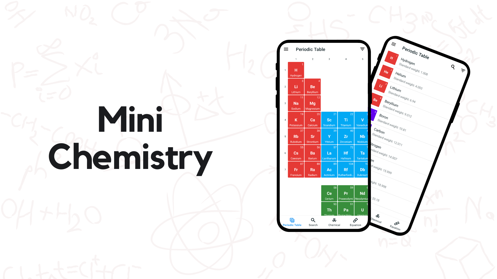

# MiniC - Mini Chemistry

Mini Chemistry - Chemistry within your reach

Mini Chemistry is an innovative mobile application that puts the world of chemistry right at your fingertips. Designed with a user-friendly and intuitive interface, this app offers an interactive and engaging way to explore the captivating field of chemistry. Mini Chemistry offers several powerful features for students.

One of the core features of Mini Chemistry is the Periodic Table. This interactive table allows users to access comprehensive information about each element. You can explore the properties, atomic numbers, and atomic masses of all the elements. You can delve into detailed data about each element with a simple tap. 

Mini Chemistry is the ultimate companion for exploring and mastering the elements and their properties, all conveniently available on your mobile device.